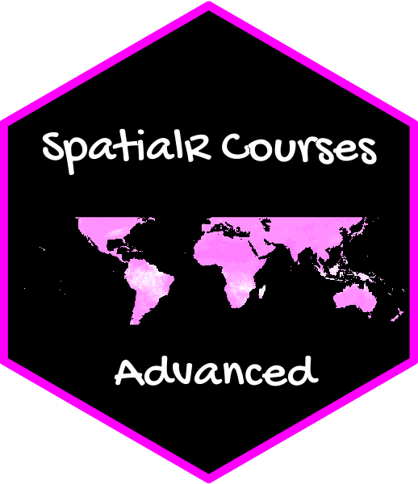

# AGEPadvanced  

> This package contains the lectures and exercises used in the course **Spatial analysis with R - Advanced course**:

- 1.  Functions and parallel computation

- 2.  Advanced spatial and temporal statistics

- 3.  Machine learning algorithms in R - I

- 4.  Machine learning algorithms in R - II

- 5.  Working with R Markdown and Leaflet

### Installation

Install development version from GitHub :

```r
remotes::install_github("obaezvil/AGEPadvanced")
```